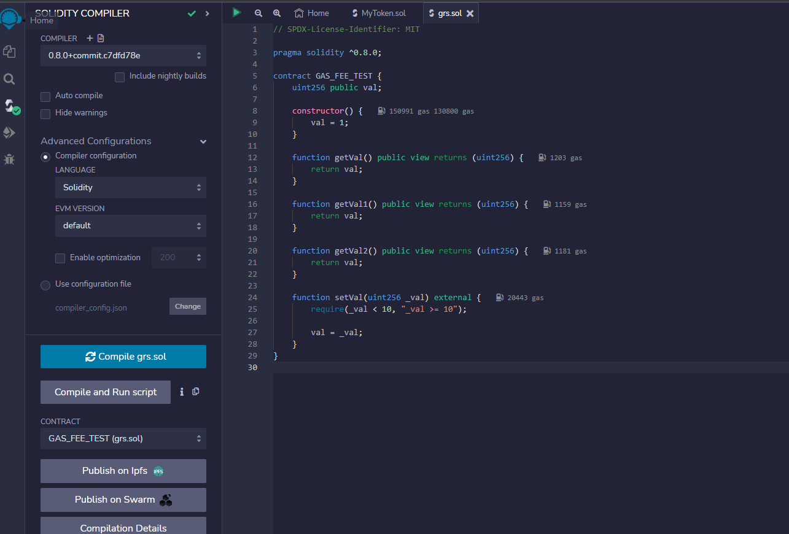

# 区块链培训作业

请大家 fork 本仓库后答题，做完后提交自己的软件仓库链接。

## 第 1 题：Solidity 语言有哪些数据类型？

列出名称即可，无需描述，例如：

-   bool
-   int8
-   uint16

答：
Solidity 语言有以下数据类型：整型、无符号整型、布尔、字符串、动态数组、固定数组、地址、字节数组、字节、引用类型、类型别名

评分标准：每个数据类型计 1 分  
参考资料： https://docs.soliditylang.org/en/latest/types.html

## 第 2 题：列举并测试以太坊的 JSONRPC API。

评分标准：每条有效的（提供文本命令和测试截图） API 计 2 分，例如：

---
答：
1、web3_clientVersion: 返回当前运行节点的客户端版本

curl -X POST --data '{"jsonrpc":"2.0","method":"web3_clientVersion","params":[],"id":1}' http://localhost:8545

2、web3_sha3: 对给定的数据做Keccak-256哈希

curl -X POST --data '{"jsonrpc":"2.0","method":"web3_sha3","params":["0x68656c6c6f20776f726c64"],"id":1}' http://localhost:8545

3、eth_blockNumber: 返回当前区块高度

curl -X POST --data '{"jsonrpc":"2.0","method":"eth_blockNumber","params":[],"id":1}' http://localhost:8545

4、eth_getBalance: 获取指定地址的余额

curl -X POST --data '{"jsonrpc":"2.0","method":"eth_getBalance","params":["0x0000000000000000000000000000000000000000","latest"],"id":1}' http://localhost:8545

5、eth_getTransactionCount: 获取指定地址的交易数

curl -X POST --data '{"jsonrpc":"2.0","method":"eth_getTransactionCount","params":["0x0000000000000000000000000000000000000000","latest"],"id":1}' http://localhost:8545

6、eth_getBlockByNumber: 获取指定区块的详细信息

curl -X POST --data '{"jsonrpc":"2.0","method":"eth_getBlockByNumber","params":["0x0","true"],"id":1}' http://localhost:8545

7、eth_getTransactionByHash: 获取指定交易的详细信息

curl -X POST --data '{"jsonrpc":"2.0","method":"eth_getTransactionByHash","params":["0x0000000000000000000000000000000000000000000000000000000000000000"],"id":1}' http://localhost:8545

8、eth_getTransactionReceipt: 获取指定交易的收据

curl -X POST --data '{"jsonrpc":"2.0","method":"eth_getTransactionReceipt","params":["0x0000000000000000000000000000000000000000000000000000000000000000"],"id":1}' http://localhost:8545

9、eth_getCode: 获取指定地址的合约代码

curl -X POST --data '{"jsonrpc":"2.0","method":"eth_getCode","params":["0x0000000000000000000000000000000000000000","latest"],"id":1}' http://localhost:8545

10、eth_gasPrice: 返回当前网络的gas价格

curl -X POST --data '{"jsonrpc":"2.0","method":"eth_gasPrice","params":[],"id":1}' http://localhost:8545


```shell
curl -s -X POST -H "Content-Type: application/json" https://matic-mumbai.chainstacklabs.com \
-d '{"id":1,"jsonrpc":"2.0","method":"net_version","params":[]}' | jq
```


---

## 第 3 题：同一个合约里代码相同的函数，为什么 GAS 费不同？

请用 Remix 验证在同一个合约里，名称不同、代码相同的函数的 GAS 费不相等，并解释原因。

评分标准：

-   验证成功： 10 分，对过程要截图
-   解释正确： 10 分

答：

    解释：在同一个合约里，不同的函数可能会有不同的 GAS 费用，因为它们可能会执行不同数量的操作或使用不同数量的存储空间。例如，如果一个函数需要在合约的存储器中存储大量数据，则它将比另一个函数消耗更多的 GAS。此外，如果一个函数调用其他函数或合约，则这也会增加 GAS 消耗。


## 第 4 题：用 Remix 部署校验合约

用 Remix 写一个合约，部署到 mumbai 链上，计算 mumbai 链的最近平均出块时间，并校验合约代码代码。

评分标准：

-   代码正确：截图 10 分
-   部署成功：截图 10 分
-   代码校验：截图 5 分
-   获取结果：截图 5 分

## 第 5 题：黑名单 ERC20 合约

### 5.1 修复 BlacklistTokenFactory 合约里的 bug

命令 `yarn deploy:mumbai` 会在 mumbai 链上部署 BlacklistTokenFactory 和一个 BlacklistToken 合约（简称 BT1 ），地址保存在 deploy/deployed/mumbai.json 文件里（提示：删除该文件可以重新部署）。请在区块链浏览器上调用 BlacklistTokenFactory 合约里的 createBlacklistToken 函数，动态创建一个 BlacklistToken 合约（简称 BT2 ）， BT2 的地址保存在 BlacklistTokenFactory 的 blacklistTokens 数组里，也可以在交易里的 CreateBlacklistToken 事件里查看 BT2 的地址。因为目前 BlacklistTokenFactory 合约里有 bug，导致 `yarn test` 报告某些测试用例失败。请在区块链浏览器上比较 BT1 和 BT2 的功能，找出 BT2 功能异常的问题现象。并尝试修复合约 contracts/BlacklistTokenFactory.sol 的代码，能通过文件 test/BlacklistTokenFactory.test.js 里全部的自动化测试。

评分标准：

-   找到问题现象： 截图 10 分
-   解释问题原因： 10 分
-   修改合约代码： 20 分
-   自动化测试全部通过： 10 分

### 5.2 优化 BlacklistTokenFactory.test.js

参考： https://hardhat.org/tutorial/testing-contracts , 使用 loadFixture 重构 test/BlacklistTokenFactory.test.js 文件。

评分标准： 30 分

### 5.3 增强 BlacklistToken 合约的功能

修改本代码仓库里的 BlacklistToken 合约代码，在转账的时候抽取 10% 的手续费，并把被扣除的手续费转给合约的创建者。

评分标准：

-   代码正确： 30 分
-   部署成功： 10 分
-   代码校验： 10 分
-   手工测试： 10 分
-   
### 5.4 对 BlacklistToken 合约进行自动化测试

目前 BlacklistToken 还没有写测试用例，请在 test/BlacklistToken.test.js 文件里尽量补齐。可参考 https://hardhat.org/tutorial/testing-contracts 和网上其它开源项目的测试用例。

评分标准：每个有效的（能执行通过）测试用例 10 分，性质相同的用例不重复计分
